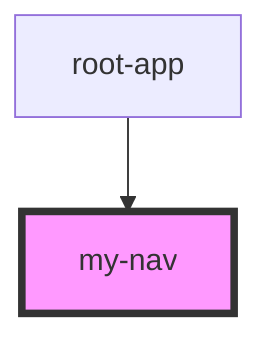

# my-nav

<!-- Auto Generated Below -->

## Properties

| Property       | Attribute       | Description | Type     | Default     |
| -------------- | --------------- | ----------- | -------- | ----------- |
| `firstHref`    | `first-href`    |             | `string` | `undefined` |
| `firstOption`  | `first-option`  |             | `string` | `undefined` |
| `logOut`       | `log-out`       |             | `string` | `undefined` |
| `secondHref`   | `second-href`   |             | `string` | `undefined` |
| `secondOption` | `second-option` |             | `string` | `undefined` |

## Dependencies

### Used by

 - [root-app](../root-app)

### Graph

----------------------------------------------

*Built with [StencilJS](https://stenciljs.com/)*
