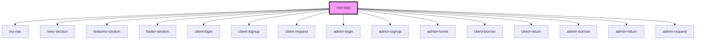

# root-app

<!-- Auto Generated Below -->

## Dependencies

### Depends on

- [my-nav](../my-nav-bar)
- [hero-section](../hero-section)
- [features-section](../features-section)
- [footer-section](../footer-section)
- [client-login](../client-login)
- [client-signup](../client-signup)
- [client-request](../client-request)
- [admin-login](../admin-login)
- [admin-signup](../admin-signup)
- [admin-home](../admin-home)
- [client-borrow](../client-borrow)
- [client-return](../client-return)
- [admin-borrow](../admin-borrow)
- [admin-return](../admin-return)
- [admin-request](../admin-request)

### Graph

----------------------------------------------

*Built with [StencilJS](https://stenciljs.com/)*
